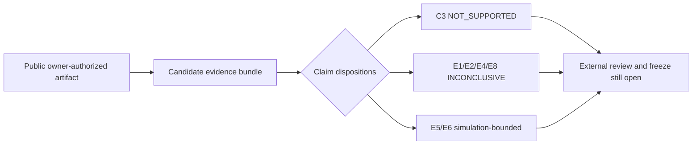

# Proof of Intelligence — Minimum Publishable Prototype Workspace

This repository is the **Minimum Publishable Prototype (MPP)** for the Proof-of-Intelligence consensus architecture.

The MPP is intentionally narrower than the full protocol. Its purpose is to generate real, reproducible evidence for the paper's central research claims without implementing the entire frontier-scale system.

Repository owner, research-artifact maintainer, and public-release authority:
**Zubaer Mahmood Zubraj** ([`@zmzubraj`](https://github.com/zmzubraj)).
The owner authorized this repository to remain publicly accessible on
30 August 2026. No repository-wide reuse licence is currently granted; public
hosting does not imply permission to reuse third-party material or claim
authorship of team-originated protocol work.

## Current scientific status

- Publication freeze: **incomplete**; external domain-expert review and the
  final freeze sentinel are absent.
- `C3`: `NOT_SUPPORTED` within the frozen E3 scope because measured
  `FAR = 0.500` exceeds `alpha_sem = 0.25`.
- `E1`, `E2`, `E4`, and `E8`: `INCONCLUSIVE` in their current scopes.
- `E5` and `E6`: supported only within their declared reproducible-simulation
  scopes.
- The repository is a public research artifact, not a peer-reviewed,
  independently validated, submission-ready, or production-safe protocol.



## Core vertical slice

`Task -> Single model execution -> Trace + Intelligence Evidence Capsule -> Commitment -> Post-commit randomized audit -> Optional dispute -> Data-availability gate -> Matured receipt -> Next-epoch PoI weight`

## What this repository must demonstrate

1. A real open-weight model can execute once and emit a user-facing response plus auditable trace/evidence commitments.
2. Concrete audit samples are generated only after the response commitment is finalized.
3. Execution tampering can be detected with bounded randomized audits and exact cheap-operation checks.
4. Grounded semantic checks can distinguish supported, unsupported, contradictory and uncertain answers with an explicit `ABSTAIN` state.
5. A receipt cannot become active while required artifacts are unavailable.
6. Service tasks cannot directly mint consensus credit; only protocol-eligible tasks can.
7. A matured receipt can be converted into next-epoch PoI weight under the credit/bond rules.
8. The normal EVM path stores compact state only; heavy AI work remains off chain.

## Prototype scope

### Primary
- 1B–3B open-weight instruct model.
- Optional 7B–8B scaling run.
- Objective tasks and grounded evidence tasks.
- Local EVM test chain (Anvil/Foundry).
- Commitment + trace + randomized audit + simple optimistic dispute.
- Grounded semantic verifier with calibrated `ABSTAIN`.
- Erasure-coded artifact availability experiment.
- PoI credit and next-epoch committee simulation.

### Explicitly out of MPP scope
- Production 70B/600B/trillion-parameter deployment.
- Full MoE distributed serving.
- Full per-response zkML proof.
- Production H100/B200 confidential-computing lane.
- Production decentralized DA network.
- New production L1 consensus client.
- Universal open-ended semantic intelligence verification.

Those are extension targets, not requirements for the first publication evidence package.

## Experiment IDs

| ID | Experiment | Main claim |
|---|---|---|
| E1 | Single-pass cost | One model execution + audit is cheaper than a two-run baseline. |
| E2 | Execution tamper detection | Post-commit execution audits detect injected corruption. |
| E3 | Grounded semantic assurance | IEC + deterministic/semantic checks produce measurable FAR/FRR/ABSTAIN. |
| E4 | Data-availability gating | Withheld artifacts fail to mature into active receipts at the expected rate. |
| E5 | Watcher/dispute economics | Invalid receipts are economically challengeable. |
| E6 | Sybil/task-budget neutrality | Identity splitting does not create material extra protocol credit. |
| E7 | EVM boundedness | Normal-path gas/state remain compact and predictable. |
| E8 | Next-epoch PoI consensus | Matured receipts become bounded validator/sequencer weight. |

## Reproducibility contract

Every reported number must be traceable to:

`config -> dataset manifest -> command -> raw output -> analysis script -> figure/table`

Do not place manually typed numbers into the paper. The publication tables and figures should be generated from `results/raw/` by scripts.

## Task 22 candidate replay

Run:

```bash
make reproduce
```

Current expected outcome on Monday, August 24, 2026:

- `scripts/reproduce.py` writes a typed candidate bundle under `results/tmp/candidates/<run_id>/`
- the candidate manifest/report state is `CANDIDATE_VERIFIED`
- the command exits nonzero with `INCOMPLETE`
- no `results/frozen/<run_id>/` directory is created
- no `MPP_ARTIFACT_COMPLETE` sentinel is created

Current expected blockers:

- the hash-pinned local Qwen2.5 1.5B artifact is present and the local-model gate is closed
- `E1` and `E2` have canonical `REAL_MODEL_EXECUTION` artifacts, but both claims remain `INCONCLUSIVE`
- `E3` has canonical `REAL_MODEL_EXECUTION` artifacts (`T4`, `T8`, `F7`, and the raw execution bundle) imported through the verified signed-revision receipt; FAR is 0.500 (1/2), FRR 0.167 (1/6), ABSTAIN 0.125 (1/8), coverage 0.875 (7/8), and Brier calibration 0.178, so frozen `alpha_sem=0.25` requires `C3=NOT_SUPPORTED`
- the E3 sample is only `n=8` with invalid `n=2`, so it does not establish general semantic reliability; evaluator real-world identity, independence, expertise, and private-key custody still require accountable out-of-band confirmation
- `E4` has canonical reproducible-simulation evidence and remains `INCONCLUSIVE`
- `E5` and `E6` are supported only within their declared reproducible-simulation scopes
- `E8` is rebuilt from the production publication replay (`REPRODUCIBLE_SIMULATION`) and regenerates `T13` / `F11` with `C8=INCONCLUSIVE`
- accountable independent domain-expert review, its trusted external signature, and the final freeze sentinel are absent

Tracked or non-runtime unversioned changes still block freezing when they exist, but ignored runtime outputs under `results/` no longer poison the Task 22 run id by themselves.

The current candidate path is intentionally evidence-closure only. It may preserve `SUPPORTED`, `NOT_SUPPORTED`, or `INCONCLUSIVE` claim dispositions when the underlying evidence exists, but it does not certify publication completeness until every gate passes.

If a future freeze ever completes, the promoted bundle must move to `FROZEN_VERIFIED`, must be reverified at the frozen destination, and only then may `MPP_ARTIFACT_COMPLETE` be written as the last file with the final manifest/report digests.

Manual scientific review is not a free-form JSON note. For production freeze completion it must be externally authenticated, use `review_basis=INDEPENDENT_DOMAIN_EXPERT_REVIEW`, carry a strict ISO `review_date`, and bind the reviewed run/artifact hashes through a detached signature verified against a trusted allowed-signers registry outside the bundle.

## First commands

```bash
make install
make data
make sanity
make experiments
make report
```

The real-model dependencies are optional in the default environment. The repository starts with deterministic synthetic/small-scale tests so protocol plumbing can be validated before GPU-heavy work.
