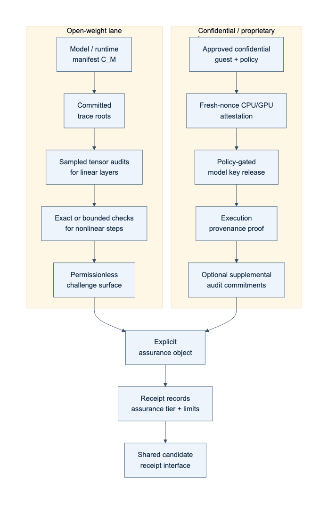
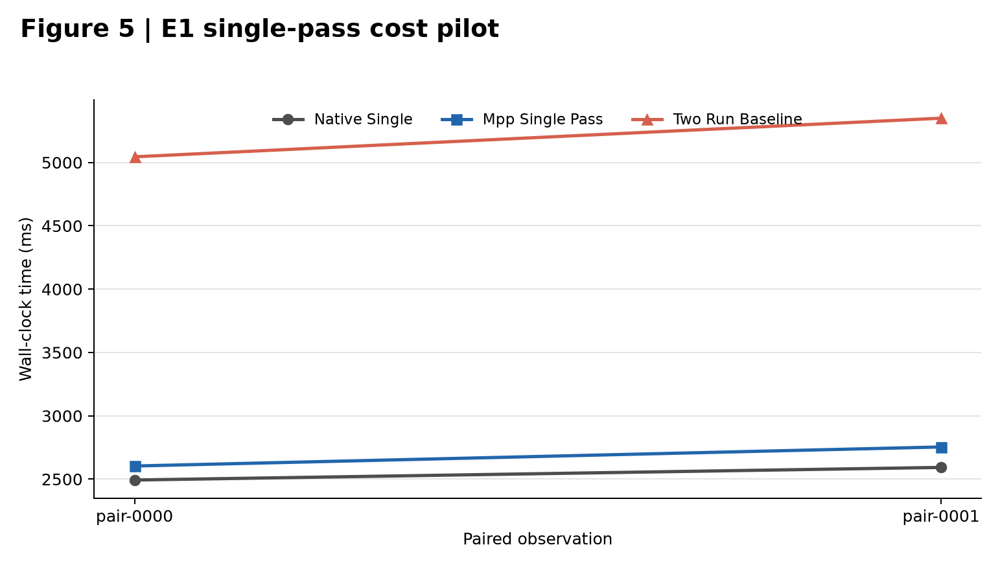
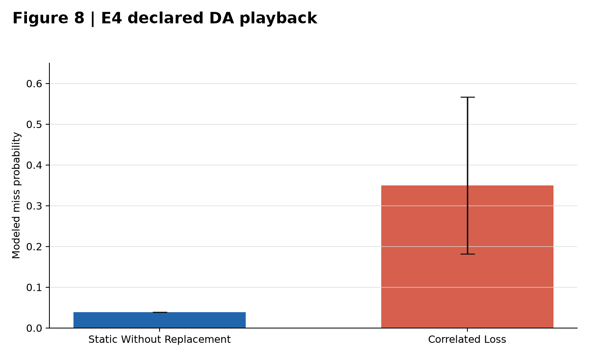
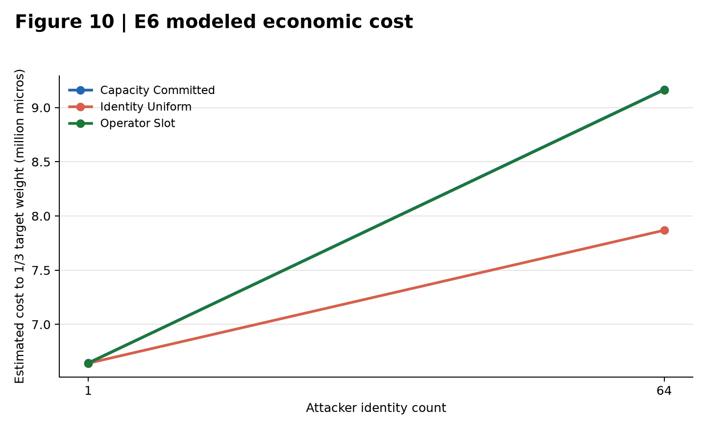
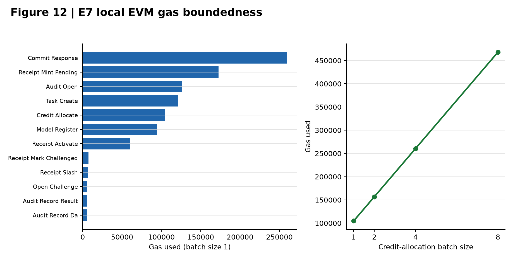
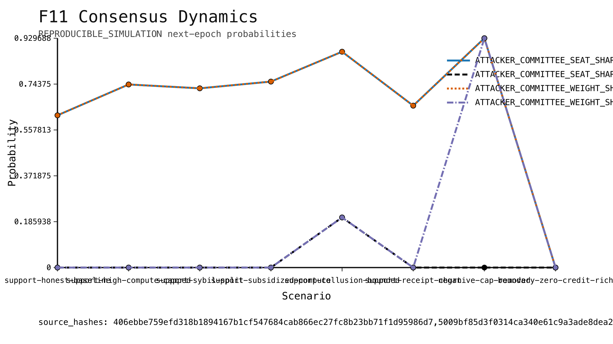

# Complete Proof of Intelligence Consensus Architecture

## A Single-Pass, Optimistic, EVM-Compatible Protocol for Verifiable AI Responses, with a Narrow Publication-Artifact MPP

## Abstract

Auditing a useful AI response should not require a mandatory second full model execution or a full zero-knowledge proof of every operation on the common path. We propose Single-Pass Auditable Intelligence (SPAI), an EVM-compatible protocol architecture in which one model execution produces a response and committed execution and semantic audit surfaces. Concrete audit obligations are selected only after response-commitment finality; successfully audited receipts mature into bounded, epoch-local protocol weight. The architecture combines model and task binding, trace and evidence commitments, post-commit audit compilation, optimistic dispute, data-availability retention, task-budgeted credit, and receipt-state management.

We evaluate a deliberately narrow Minimum Publishable Prototype (MPP) using a 1.5B open-weight model, local Foundry measurements, and reproducible experiments E1-E8. The current evidence is mixed and non-compensating. E1 and E2 are inconclusive real-model pilots; E4 and E8 are inconclusive simulations; E5 and E6 support only their frozen simulation scenarios; E7 supports local EVM boundedness; and an externally authorized, post-execution-attested E3 real-model run produced a negative result. E3 measured FAR 0.500 (1/2), FRR 0.167 (1/6), ABSTAIN 0.125 (1/8), coverage 0.875 (7/8), and Brier calibration 0.178. Because FAR exceeded the frozen `alpha_sem=0.25` threshold, C3 is `NOT_SUPPORTED`. The run contained only n=8 items, including invalid n=2, and does not establish general semantic reliability. The strongest positive measured result remains local Foundry boundedness: 15 operations or batch observations, a maximum observed gas value of 467,937, and a maximum configured-block-limit fraction of 0.0004358003. These results support feasibility of the narrow artifact-oriented MPP, not production consensus security, general semantic verification, or frontier-scale deployment.

**Keywords:** proof of intelligence, verifiable AI inference, blockchain consensus, optimistic verification, evidence provenance, smart contracts

## 1. Introduction

The expensive part of modern AI serving is the model execution itself. A PoI system that requires a second large-model generation for every accepted response, or a full proof of all tensor operations for the common path, inherits an immediate structural cost barrier. The systems question addressed here is whether useful AI responses can be made auditable without paying either of those costs on the normal path.

The proposed answer is Single-Pass Auditable Intelligence (SPAI): one committed response, one model execution, one set of committed execution and semantic audit surfaces, one post-commit randomized audit process, and one maturity rule that converts only successfully audited events into bounded protocol authority. The architectural goal is not to claim novelty for optimistic fraud proofs [1,2], algebraic matrix checks [6], remote attestation [3,4,7], data-availability sampling [11], zero-knowledge machine-learning verification [9,10], or weighted Byzantine fault tolerance [12] in isolation. The architectural claim is narrower: these components can be composed into a complete PoI path that avoids two common-path cost barriers while preserving explicit failure states and assurance tiers.

CommitLLM [5] is the closest implementation-level predecessor identified in the present bounded review. It likewise commits open-weight LLM inference artifacts, opens trace material only under challenge, and uses exact and Freivalds-style audit checks without requiring a proof for every response. opML [1] independently establishes a closely related optimistic fraud-proof route for on-chain machine learning. Consequently, this manuscript does not claim a new primitive for committed LLM execution or optimistic dispute. Its provisional differentiator is the wider protocol composition that links execution and semantic evidence, retention and challenge state, non-transferable receipt maturity, task-budgeted credit, and bounded next-epoch consensus weight. That composition-level novelty remains subject to a reproducible strongest-prior-art search and independent challenge.

This manuscript must be read in two distinct layers:

1. the full protocol architecture proposed by the paper; and
2. the current repository-backed MPP, which implements a narrower, evidence-gated subset for publication artifacts.

That separation is necessary because the architecture is broader than the current evidence package, and the repository intentionally refuses to promote missing, simulated, synthetic, or externally blocked surfaces into completed empirical claims.

## 2. Scope and contribution boundary

### 2.1 Proposed full architecture

The proposed full architecture includes:

- one-pass AI execution with post-commit audits;
- open-weight execution checks from committed traces and algebraic audits;
- an optimistic challenge and dispute path;
- a confidential or proprietary execution lane based on attestation;
- data-availability retention and withholding response;
- bounded task credit and next-epoch weight conversion;
- EVM-compatible receipt and credit settlement; and
- future scaling to larger frontier or MoE deployments.

Conceptual figure and algorithm sources are preserved in editable form under:

- `docs/diagrams/D1_system_architecture.mmd`
- `docs/diagrams/D2_spai_sequence.mmd`
- `docs/diagrams/D3_receipt_state.mmd`
- `docs/diagrams/D4_audit_compiler.mmd`
- `docs/diagrams/D5_economic_flow.mmd`
- `docs/diagrams/D6_semantic_audit.mmd`
- `docs/algorithms/A1_SPAI.md`
- `docs/algorithms/A2_AuditCompiler.md`
- `docs/algorithms/A3_VerifySPAIEvent.md`
- `docs/algorithms/A4_PoI_Credit.md`
- `docs/algorithms/A5_Optimistic_Dispute.md`

### 2.2 Implemented first-publication MPP

The approved first-publication MPP is narrower. Its frozen design logic is the three-layer structure already fixed in the repository:

1. evidence kernel: canonical schemas, hashing, provenance, configuration, and artifact validation;
2. protocol kernel: task -> commitment -> audit -> challenge or DA -> receipt -> credit lifecycle;
3. vertical experiment slices: E1-E8, each with its own RED-GREEN-REFACTOR cycle and publication gate.

The publication MPP is limited to:

- one 1B-3B open-weight primary model and one optional 7B-8B scaling model;
- objective and grounded task classes only;
- a local EVM using Foundry and Anvil;
- reproducible E1-E8 artifact plumbing;
- explicit negative, incomplete, and inconclusive reporting.

The publication MPP explicitly defers:

- 70B or larger validation;
- MoE or distributed production serving;
- confidential GPU or TEE execution;
- a production-grade dispute VM;
- production DA infrastructure;
- a production consensus client.

### 2.3 Evidence-origin rule

Synthetic data is permitted only for plumbing tests and must remain labeled `SYNTHETIC_NON_EVIDENCE`. Paper tables and figures may derive only from:

- authorized real execution;
- Foundry measurement; or
- explicitly declared reproducible simulation.

This rule is enforced by the repository’s artifact contract and is essential to interpreting the current manuscript honestly.

## 3. Proposed full architecture


### 3.1 Single-pass auditable event

The core protocol path is:

`task -> execute once -> trace + Intelligence Evidence Capsule -> commitment -> post-commit audit -> challenge or DA gate -> matured receipt -> next-epoch weight`

The key design rule is that the concrete audit sample is not known before the response commitment is finalized. This preserves audit unpredictability while avoiding a second full model run on the normal path.


Algorithm 1. Single-Pass Auditable Intelligence event.

```text
Input: active policy C_P, task contract C_T, model/runtime manifest C_M
1. Execute the bound model once to obtain response y.
2. Commit trace root R_X, evidence root R_E, artifact root C_A, and H(y).
3. Finalize response commitment C_R before revealing the audit sample.
4. Derive post-commit seed eta and compile execution and semantic obligations.
5. Verify required openings, data availability, policy, and challenge results.
6. If a hard predicate fails, reject or slash; if semantics remain unresolved, abstain.
7. Otherwise mint a pending receipt; activate it only after retention and challenge windows close.
8. Make only active, policy-eligible receipts available for bounded next-epoch credit.
Invariant: the worker cannot know the concrete audit sample before C_R is final.
```

Algorithm 2. Post-commit audit compiler.

```text
Input: C_P, C_T, finalized C_R, epoch beacon, audit round
1. Verify that C_P is active and C_R is final.
2. Compute eta = H(domain || beacon || C_T || C_R || audit_round).
3. Derive execution sample S_X and semantic obligations S_S from eta and policy.
4. Bind every obligation to C_R and publish identifiers and deadlines.
Output: (S_X, S_S).
```

### 3.2 Execution assurance lanes

The full architecture defines two execution-assurance lanes:

- an open-weight lane based on trace commitments, bounded exact checks, and randomized algebraic audits; and
- a confidential lane based on remote attestation and policy-gated execution provenance.

Only the open-weight lane belongs to the current first-publication MPP. The confidential lane is architecture only in this manuscript and is not an empirically supported repository result.



### 3.3 Semantic verification and the Intelligence Evidence Capsule

The architecture binds claims, evidence roots, dependency edges, uncertainty tags, executable artifacts, and coverage maps to the same response event. The semantic audit taxonomy distinguishes objective, grounded, open-semantic, and underdetermined classes. The implemented MPP preserves only the objective and grounded subset. Open-ended semantic competence remains outside the current publication-validated surface.

Algorithm 3. Verify one SPAI event.

```text
Input: C_P, C_T, C_M, C_R, R_X, R_E, DA certificate, nullifier, receipt state
1. Require active policy, eligible task, and final commitment before seed reveal.
2. Recompute S_X and S_S and verify exact model/runtime binding.
3. Verify required execution openings or a mature dispute result.
4. Verify semantic obligations against y and R_E.
5. If calibration is invalid or disagreement exceeds policy, return ABSTAIN.
6. Verify DA, nullifier uniqueness, deadlines, and receipt predicates.
7. Return REJECT on any hard failure; otherwise return ACCEPT.
```

### 3.4 Receipt, credit, and next-epoch authority

The full architecture mints non-transferable intelligence receipts that pass through commitment, audit, challenge, and maturity stages before bounded task credit is allocated. Only matured, policy-eligible receipts contribute to next-epoch weight. This separates service work from consensus authority and preserves the rule that collateral cannot mint PoI weight by itself.

Algorithm 4. Bounded credit and next-epoch weight.

```text
Input: matured receipts in epoch e, task budgets D_j, quality/assurance factors, bond and concentration caps
1. For every task j, enforce sum_i c_ij <= D_j.
2. Aggregate Q_i^(e+1) = sum_j c_ij.
3. Set W_i^(e+1) = min(Q_i^(e+1), B_i / beta, ConcentrationCap_i).
4. Sample next-epoch participation proportional to W_i^(e+1).
Invariant: Q_i = 0 implies W_i = 0; collateral caps authority but cannot create credit.
```

### 3.5 Optimistic dispute boundary

The architecture localizes a challenged trace interval and resolves only the final bounded disagreement. This is related to optimistic fault-proof design [1,2], but a general production transformer-kernel dispute VM is explicitly deferred.

Algorithm 5. Optimistic dispute localization.

```text
Input: pending receipt, bonded challenge, committed disputed interval
1. Submit the challenge and disputed interval.
2. Require the worker's corresponding opening.
3. Bisect until one bounded deterministic step remains.
4. Evaluate that step directly or with a micro-proof.
5. Slash the losing party, pay the configured reward, and update receipt state.
Boundary: the current MPP does not implement a production-grade general dispute VM.
```

## 4. Implemented MPP

### 4.1 Repository structure

The implemented repository follows the frozen three-layer design and places the publication logic under a deterministic artifact pipeline. The practical shape is:

`raw data -> aggregation script -> table or figure artifact -> manuscript`

This means the manuscript is downstream of the evidence kernel rather than a freehand reporting layer.

Relevant repository contracts include:

- `README.md`
- `docs/EXPERIMENT_PLAN.md`
- `docs/EXPERIMENT_ARTIFACT_MATRIX.md`
- `docs/ARTIFACT_COLLECTION_GUIDE.md`
- `docs/PAPER_ARTIFACT_MAP.md`
- `docs/MAIN_RESULTS_TARGETS.md`

### 4.2 End-to-end state

Within its approved scope, the MPP software is materially implemented: evidence schemas, protocol objects, Python-Solidity parity surfaces, reporting builders, Foundry contract scaffolds, and a canonical publication-artifact pipeline are present. The manifest is the source of truth for result status; software implementation does not compensate for an inconclusive experiment, a missing authorization required for any future execution, missing independent review, or an absent freeze sentinel. The retained E3 run is not authority-blocked: its signed-revision pre-execution authorization and post-execution artifact attestation were verified, and its negative result remains `C3=NOT_SUPPORTED`.

### 4.3 Canonical publication state

The canonical artifact manifest contains E1-E8 result surfaces, including the externally attested negative E3 result, and contains no E3 omission after verified import. It does not make the manuscript publication-ready. E3 evaluator identity/independence/key-custody confirmation, independent review, and the freeze-sentinel gates remain open. These gate states are part of the scientific interpretation rather than formatting or administrative details.

## 5. Experimental design and artifact contract

Experiments E1-E8 are defined in `docs/EXPERIMENT_PLAN.md`, mapped to paper artifacts in `docs/EXPERIMENT_ARTIFACT_MATRIX.md`, and collected through `docs/ARTIFACT_COLLECTION_GUIDE.md`. The paper-facing artifact contract is intentionally strict:

- no manually typed scientific results in tables or figures;
- every paper artifact must derive from configuration, raw output, and code;
- synthetic plumbing must not be promoted into publication evidence;
- incomplete and inconclusive states must remain visible.

That contract matters because the current manuscript includes both evidence-bearing and non-evidence-bearing surfaces, and they must not be conflated.

## 6. Current evidence

### 6.1 Claim-level summary

The canonical claim matrix records C1 `INCONCLUSIVE`, C2 `INCONCLUSIVE`, E3
C3 `NOT_SUPPORTED`, C4 `INCONCLUSIVE`, C5 `SUPPORTED` within a declared
simulation, C6 `SUPPORTED` within a declared simulation, E7 local boundedness
`SUPPORTED`, and E8 `INCONCLUSIVE`. Those dispositions are non-compensating.

Table 1. Canonical MPP evidence status. “Supported” is confined to the origin and scope shown; it does not imply production or field validation.

| Experiment | Evidence origin | n | Disposition | Claim ceiling |
|---|---|---:|---|---|
| E1 | Real-model execution | 2 paired observations | `INCONCLUSIVE` | Fixed-order cost pilot only |
| E2 | Real-model execution | 4 attacks + 1 honest control | `INCONCLUSIVE` | Frozen 4-by-4 audit surfaces only |
| E3 | Externally attested negative real-model run | 8 | `NOT_SUPPORTED` | No semantic-performance claim |
| E4 | Reproducible declared playback | 2 scenarios | `INCONCLUSIVE` | Declared-outcome playback only |
| E5 | Reproducible simulation | 2 scenarios | `SUPPORTED` | Frozen watcher-economics scenarios only |
| E6 | Reproducible simulation | 6 scenarios | `SUPPORTED` | Frozen identity/capacity scenarios only |
| E7 | Local Foundry measurement | 15 rows | `SUPPORTED` | Local EVM boundedness only |
| E8 | Reproducible simulation | 10 rows | `INCONCLUSIVE` | Modeled next-epoch dynamics only |

### 6.2 E1 and E2: bounded real-model pilots

E1 (T6, F5) is a fixed-order real-model pilot with two paired observations and
six measured rows. The mean two-run baseline is 5197.17125 ms, the mean MPP
single-pass measurement is 2678.932229 ms, and the paired delta is 2518.239021
ms with bootstrap interval [2440.923209, 2595.554833]. Fixed ordering leaves
E1 `INCONCLUSIVE`; this result cannot support a general C1 cost-advantage
claim.



E2 (T7, F6) is a narrow real-model pilot. It records 4/4 detected attacked
observations across three exact and one empirical floating-point surface, with
Wilson interval [0.5101091635454027, 1.0], plus one honest control and no false
positive. It remains `INCONCLUSIVE`, not a general execution-audit efficacy
claim.


### 6.3 E3-E6: negative semantic result and declared simulations

E3 (T4, T8, F7) is an externally authorized and post-execution-attested
`REAL_MODEL_EXECUTION` run. It measured FAR 0.500 (1/2), FRR 0.167 (1/6),
ABSTAIN 0.125 (1/8), coverage 0.875 (7/8), and Brier calibration 0.178. The
frozen decision rule is `alpha_sem=0.25`; because FAR exceeded that threshold,
C3 is `NOT_SUPPORTED`. The sample contained only n=8 items, including invalid
n=2, so the run does not establish general semantic reliability. The cryptographic validity
authenticates the signed authority/attestation bytes and exact artifact
hashes; it does not prove the evaluator's real-world identity, independence,
expertise, or private-key custody, which require accountable out-of-band
confirmation.


E4 (T9, F8) is an `INCONCLUSIVE` declared playback simulation, not executed
reconstruction evidence. E5 (T10) is `SUPPORTED` only for its declared
watcher/dispute-economic simulation scenarios and has no figure. E6 (T11, F9,
F10) is `SUPPORTED` only for its declared Sybil/task-budget simulation
scenarios. Neither E5 nor E6 supplies production or open-network evidence.






### 6.4 E7 and E8: local measurement and simulation

E7 (T12, F12) contains 15 `SUPPORTED` local Foundry measurements. The largest
observed gas value is 467937 for `CREDIT_ALLOCATE` at batch size 8, and the
maximum fraction of the configured block limit is 0.00043580029159784317. This
supports local boundedness only; it does not establish Ethereum-mainnet
economics, production throughput, or production consensus performance.



E8 (T13, F11) contains 10 `INCONCLUSIVE` reproducible-simulation rows. It may
describe modeled receipt-to-weight dynamics, but it is not demonstrated
consensus security.



## 7. Discussion

### 7.1 What the repository currently demonstrates

The repository currently demonstrates:

- a coherent reduction of the full PoI architecture into a bounded publication MPP;
- a fail-closed evidence kernel with explicit provenance, validation, and omission handling;
- Python-Solidity parity discipline for the implemented protocol kernel;
- local EVM boundedness evidence for the approved contract surfaces; and
- a reproducible simulation surface for next-epoch weight conversion.

### 7.2 What it does not yet demonstrate

The repository does not yet demonstrate:

- general semantic reliability: the externally authorized and post-execution-attested E3 real-model run was negative under the frozen rule (`C3=NOT_SUPPORTED`) and included only eight items, including two invalid items;
- a publication-freeze sentinel;
- authenticated independent manual review;
- 70B or larger model validation;
- MoE or distributed production validation;
- confidential GPU or TEE execution evidence;
- a production-grade dispute VM;
- a production consensus client; or
- a frozen publication bundle with authenticated independent manual review.

## 8. Limitations and evidence-origin disclosure

This manuscript enforces five evidence-boundary disclosures.

First, score tables and unsupported percentages are omitted. The current repository state does not justify compensating aggregate scores across architecture, implementation, evidence, and readiness.

Second, novelty remains provisional. A bounded review identified CommitLLM [5] and opML [1] as strong predecessors for committed open-weight inference and optimistic dispute. The repository does not yet contain a reproducible strongest-prior-art search package or a differently owned independent novelty challenge sufficient to defend a stronger composition-level novelty claim.

Third, semantic claims are narrow. The implemented MPP is limited to objective and grounded tasks, not open-ended semantic competence.

Fourth, empirical support is heterogeneous. E1, E2, E4, and E8 are `INCONCLUSIVE`; E5 and E6 are supported only within declared simulation scenarios; and E7 is supported only for local Foundry boundedness. E3 is an externally attested real-model run, `NOT_SUPPORTED` (FAR 0.500 > alpha_sem 0.25).

Fifth, the canonical bundle remains not publication-ready because it preserves unresolved gates rather than relabeling them as success. E3 pre-execution authority and its externally signed post-execution artifact attestation were verified for the hash-bound signed revision, but cryptographic validity alone does not prove the evaluator's real-world identity, independence, expertise, or private-key custody. Those out-of-band confirmations, authenticated independent manual review, and the publication-freeze sentinel remain required. Neither AI production nor user approval is independent review.

## 9. Deferred future phases

The following surfaces are deferred and should remain labeled as future work rather than current evidence:

- 70B, 600B, and MoE execution validation;
- confidential or proprietary execution with GPU or TEE attestation;
- a production-grade dispute VM;
- production DA infrastructure;
- weighted BFT integration in a production consensus client;
- independent cryptographic, semantic, contract, and economic audits; and
- a fully frozen publication bundle with authenticated external manual review.

## 10. Conclusion

The proposed PoI architecture addresses a real systems problem: how to make useful AI responses auditable without requiring a second full frontier-model execution or a full common-path proof for each accepted response. The architecture combines response commitment, execution and semantic audit surfaces, post-commit randomness, optimistic dispute, DA retention, bounded task credit, and EVM-compatible receipt management into a coherent protocol proposal.

The current repository substantiates that this architecture can be reduced into a disciplined first-publication MPP. The strongest present positive repository-grounded result is local EVM boundedness (E7). E1 and E2 have canonical but inconclusive real-model pilot artifacts; E4 and E8 are inconclusive simulations; E5 and E6 are supported only within their declared simulations; and E3 is a canonical externally attested negative real-model result with C3 `NOT_SUPPORTED`. The manuscript must preserve each boundary.

The correct current interpretation is therefore not that the architecture is fully validated, and not that it is merely conceptual. It is that a coherent PoI MPP has been implemented with strong fail-closed artifact discipline, while the central publication evidence package remains only partially complete.

## Reproducibility and artifact availability

The current candidate report bundle is rooted at `publication/artifact_manifest.json`, SHA-256 `1e8e57869d68bafdbcbdcf59a81e1f6d6c5d5089188a88f80a99d12748fcb722`. It contains machine-readable tables, quantitative SVG and JSON outputs, the claim matrix, and the omission ledger. Mechanical manifest validation passes against the current bound inputs. This verifies byte-level closure and deterministic binding only; it does not freeze the bundle or establish scientific validity. Conceptual diagrams are retained as editable Mermaid source, and Algorithms 1-5 are retained as manuscript-ready pseudocode and detailed source specifications. Paper-only PNGs are deterministic presentation derivatives generated from canonical figure JSON by `scripts/build_paper_figures.py`; they do not replace the canonical evidence artifacts.

The bundle is intentionally not frozen for submission. E3 pre-execution authority and post-execution artifact attestation were cryptographically verified for the hash-bound signed revision, but real-world evaluator identity, independence, expertise, and private-key custody still require accountable out-of-band confirmation. Authenticated independent manual review and the freeze sentinel remain open. AI production, AI review, user approval, clean tests, and matching hashes do not by themselves constitute independent scientific review or authorize submission.

## References

[1] K. D. Conway, C. So, X. Yu, and K. Wong. “opML: Optimistic Machine Learning on Blockchain.” arXiv:2401.17555, 2024.

[2] Optimism Collective. “Fault Proof.” OP Stack Specification, accessed August 23, 2026.

[3] A. Chan, A. Ding, F. Chen, A. Wu, B. Zhang, and A. Tian. “Optimistic TEE-Rollups: A Hybrid Architecture for Scalable and Verifiable Generative AI Inference on Blockchain.” arXiv:2512.20176, 2025.

[4] NVIDIA. “Attestation and Key-Release Flow.” In *Deploying Proprietary Models Securely with NVIDIA Confidential Computing on Self-Hosted Virtual Machines*, updated June 4, 2026.

[5] LambdaClass. “CommitLLM.” Official project repository and engineering documentation, accessed August 23, 2026. Grey literature.

[6] H. Ji, M. Mascagni, and Y. Li. “Gaussian Variant of Freivalds’ Algorithm for Efficient and Reliable Matrix Product Verification.” arXiv:1705.10449, 2017.

[7] Intel Trust Authority. “GPU Remote Attestation with Intel Trust Authority.” Official documentation, updated June 16, 2026.

[8] D. Ribeiro Alves, V. Patankar, M. Pereira, J. Stephens, N. Vaziri, and S. Kannan. “EigenAI: Deterministic Inference, Verifiable Results.” arXiv:2602.00182, 2026.

[9] W. Qu, Y. Sun, X. Liu, T. Lu, Y. Guo, K. Chen, and J. Zhang. “zkGPT: An Efficient Non-interactive Zero-knowledge Proof Framework for LLM Inference.” In *Proceedings of the 34th USENIX Security Symposium (USENIX Security 25)*, 2025.

[10] Z. Peng, C. Zhao, T. Wang, G. Liao, Z. Lin, Y. Liu, B. Cao, L. Shi, Q. Yang, and S. Zhang. “A Survey of Zero-Knowledge Proof Based Verifiable Machine Learning.” *Artificial Intelligence Review* 59, 157 (2026).

[11] M. Yu, S. Sahraei, S. Li, S. Avestimehr, S. Kannan, and P. Viswanath. “Coded Merkle Tree: Solving Data Availability Attacks in Blockchains.” In *Financial Cryptography and Data Security (FC 2020)*, LNCS 12059, pp. 114-134, 2020.

[12] M. Yin, D. Malkhi, M. K. Reiter, G. G. Gueta, and I. Abraham. “HotStuff: BFT Consensus with Linearity and Responsiveness.” In *Proceedings of the 2019 ACM Symposium on Principles of Distributed Computing (PODC 2019)*, pp. 347-356, 2019.
